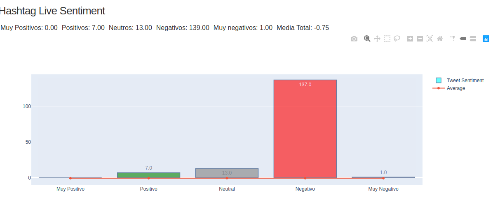

# **iHashTag**
---------------------
## 1. Objetivo:

El objetivo de este proyecto es la utilización de las tecnologías aplicadas en la asignatura Computación Distribuida del cuarto curso del grado en Tecnologías 
de la Telecomunicación de la Universidad Carlos III de Madrid.
En concreto el objetivo de este proyecto es realizar un estudio en streaming de /#Hashtags, pudiéndo observar en todo momento en una interfaz gráfica la 
evolución del sentimiento de dichos tweets. Esto servirá para poder tomar conclusiones conforme a estos resultodos, o incluso aprovechar la interfaz gráfica
para poder incluso proponer cierta actuaciones para variar el sentimiento de los tweets.
Hay que dejar claro, que un sentimiento negativo en el estudio no siempre repercute de manera negativa al /#Hashtag de estudio en concreto.


## 2. Resumen:

Indicaré de manera detallada de qué está formado el proyecto y su explicación correspondiente. Ordenaré conforme a la relación que se tenga entre
las clases correspondientes.

1. StreamTwitterProducer.java
2. StreamKafkaConsumer.java
3. mongoHandler.java
4. SentimentMongo.java
5. SentimentMongo2.java
6. TweetTreatment.java
7. SentimentAnalyzer.java
8. TweetWithSentiment.java
9. main.java
10. dash_init.py
11. dash_final.py

#### 1. StreamTwitterProducer.java
En esta clase lo que hacemos en general es:
1. Configuración para el uso de la API de Twitter.
2. Configuración para el uso de un productor Kafka.
3. Uso de Api Stream de Twitter y del Broker Kafka.
4. Ingesta de datos en topicName

En este caso; primeramente deberemos realizar la configuración para poder usar la api stream de Twitter. Luego es indispensable, poder lograr una
conexión con el broker kafka al cual enviaremos los datos. En este caso, creando si fuera necesario un topic (topicName) si este no existiera; el
topicName es el parámetro tanto de filtrado en tweets como para la creación del topic (en la creación del topic se omite el caracter #).
Luego, cada vez que se nos notifique la llegada de un nuevo tweet, procederemos a enviarlo al topic asociado del broker Kafka.
Como se puede observar, en el filtrado de tweets stream, ponemos la restricción que sean tweets en Inglés debido a que la clase que usamos para
el análisis de sentimiento, sólo tiene soporte para tweets en Inglés.

```java
package iHashTag;

import java.io.IOException;
import java.net.InetSocketAddress;
import java.nio.ByteBuffer;
import java.nio.channels.AsynchronousServerSocketChannel;
import java.nio.channels.AsynchronousSocketChannel;
import java.nio.channels.CompletionHandler;
import java.nio.channels.ServerSocketChannel;
import java.nio.charset.StandardCharsets;
import java.util.Map;

import twitter4j.FilterQuery;
import twitter4j.StallWarning;
import twitter4j.Status;
import twitter4j.StatusDeletionNotice;
import twitter4j.StatusListener;
import twitter4j.TwitterStream;
import twitter4j.TwitterStreamFactory;
import twitter4j.conf.ConfigurationBuilder;

import com.google.gson.*;

import java.util.Properties;
import java.util.Scanner;

import org.apache.kafka.clients.producer.Producer;
import org.apache.kafka.clients.producer.KafkaProducer;
import org.apache.kafka.clients.producer.ProducerRecord;

public class StreamTwitterProducer {

	/*
	 * Variables Stream Twitter
	 */
	public static final String _consumerKey = "";
	public static final String _consumerSecret = "";
	public static final String _accessToken = "";
	public static final String _accessTokenSecret = "";
    private static final boolean EXTENDED_TWITTER_MODE = true;

    
    
	public static void main(String[] args) {

		Scanner teclado = new Scanner(System.in);
		
		/*
		 * Configuración Productor Kafka
		 */
		
		System.out.println("------- BIENVENIDO AL PRODUCTOR TWITTER-KAKFA -------");
		System.out.println("------- Por favor, ingresa el Hashtag a seguir ------");
		String topicName = teclado.nextLine();
		System.out.println("------- Ha decidido usted stremear a: "+ topicName+" ------");
		teclado.close();
		
		
		Properties props = new Properties();
		props.put("bootstrap.servers", "localhost:9092");
		props.put("acks", "all");
		//If the request fails, the producer can automatically retry,
	    props.put("retries", 0);
	      
	    //Specify buffer size in config
	    //props.put("batch.size", 16384);
	      
	    //Reduce the no of requests less than 0   
	    //props.put("linger.ms", 1);
	      
	    //The buffer.memory controls the total amount of memory available to the producer for buffering.   
	    //props.put("buffer.memory", 33554432);
	      
	    props.put("key.serializer", 
	        "org.apache.kafka.common.serialization.StringSerializer");
	         
	    props.put("value.serializer", 
	       "org.apache.kafka.common.serialization.StringSerializer");
		
	    Producer<String, String> producer = new KafkaProducer<String,String>(props);
	    
		
		ConfigurationBuilder configurationBuilder = new ConfigurationBuilder();
		configurationBuilder.setOAuthConsumerKey(_consumerKey).setOAuthConsumerSecret(_consumerSecret)
				.setOAuthAccessToken(_accessToken).setOAuthAccessTokenSecret(_accessTokenSecret);

		
		TwitterStream twitterStream = new TwitterStreamFactory(configurationBuilder.build()).getInstance();

		twitterStream.addListener(new StatusListener() {

			/* when a new tweet arrives */
			public void onStatus(Status status) {

				if (status.getRetweetedStatus() == null) {
					Gson gson = new Gson();
					String json_string = gson.toJson(status);
					
					producer.send(new ProducerRecord<String,String>(topicName.replace("#", ""),
							json_string));
					
					//System.out.println("Mensaje enviado");
					//System.out.println(status.getText());
					//System.out.println("TWEET SIN RETTWETEAR");

				}else {
					Gson gson = new Gson();
					String json_string = gson.toJson(status);
					
					producer.send(new ProducerRecord<String,String>(topicName.replace("#", ""),
							json_string ));
					//System.out.println("Mensaje enviado");
					//System.out.println(status.getText());
					//System.out.println("TWEET RETTWETEADO");

				}
				System.out.println("--------------------------------");
			}
			
			public String statusJsonImplToString(String tweet) {
				String final_string;
				
				final_string ="{content_tweet:"+tweet+"}";
				
				return final_string;
			}

			@Override
			public void onException(Exception arg0) {
				System.out.println("Exception on twitter");

			}

			@Override
			public void onDeletionNotice(StatusDeletionNotice arg0) {
				System.out.println("Exception on twitter");

			}

			@Override
			public void onScrubGeo(long arg0, long arg1) {
				System.out.println("onScrubGeo");

			}

			@Override
			public void onStallWarning(StallWarning arg0) {
				System.out.println("EonStallWarning");

			}

			@Override
			public void onTrackLimitationNotice(int arg0) {
				System.out.println("EonTrackLimitationNotice");

			}
		});

		FilterQuery tweetFilterQuery = new FilterQuery(); // See
		tweetFilterQuery.track(new String[] {topicName}).language("en"); // , "Teletubbies"}); // OR on keywords

		// ejemplo de localización  (desde USA)
		// tweetFilterQuery.locations(new double[][]{new  double[]{-126.562500,30.448674}, new double[]{-61.171875,44.087585 }});
		// See https://dev.twitter.com/docs/streaming-apis/parameters#locations for
		// proper location doc.
		// Note that not all tweets have location metadata set.
		// ejemplo de idioma  (en inglés)
		/* tweetFilterQuery.language(new String[]{"en"}); */ 
		twitterStream.filter(tweetFilterQuery);
	}
}
```

#### 2. StreamKafkaConsumer.java
En esta clase lo que hacemos en general es:
1. Configuración para el uso de un consumidor Kafka.
2. Configuración para poder usar una base de datos NoSQL como MongoDB.
3. Ingesta de Documentos en MongoDB.


```java
package iHashTag;

import java.util.Properties;
import java.util.Scanner;
import java.util.ArrayList;
import java.util.Arrays;
import java.util.List;

import org.apache.kafka.clients.consumer.KafkaConsumer;
import org.apache.kafka.clients.consumer.ConsumerRecords;
import org.apache.kafka.clients.consumer.ConsumerRecord;
import org.json.*;

import com.google.gson.Gson;
import com.google.gson.GsonBuilder;
import com.google.gson.JsonObject;

import edu.stanford.nlp.pipeline.StanfordCoreNLP;

public class StreamKafkaConsumer{
	
   public static void main(String[] args) throws Exception {
	   Scanner teclado = new Scanner(System.in);
	   
	   System.out.println("------- BIENVENIDO AL CONSUMIDOR TWITTER-KAKFA -------");
	   System.out.println("------- Por favor, ingresa el Hashtag a seguir ------");
	   String topicName = teclado.nextLine();
	   System.out.println("------- Ha decidido usted stremear a: "+ topicName+" ------");
	   
	   teclado.close();
	   
      //Kafka consumer configuration settings
      //String topicName = args[0].toString();
      Properties props = new Properties();
      int size = 0;
      int offset = 0;
      String variables [] = {"-10", "-11"};
      
      props.put("bootstrap.servers", "localhost:9092");
      props.put("group.id", "test");
      //props.put("enable.auto.commit", "true");
      //props.put("auto.commit.interval.ms", "1000");
      //props.put("session.timeout.ms", "30000");
      props.put("key.deserializer", 
         "org.apache.kafka.common.serialization.StringDeserializer");
      props.put("value.deserializer", 
         "org.apache.kafka.common.serialization.StringDeserializer");
      
      KafkaConsumer<String, String> consumer = new KafkaConsumer
         <String, String>(props);
      
      mongoHandler mongodbHandler = new mongoHandler(topicName);
      
      //Kafka Consumer subscribes list of topics here.
      consumer.subscribe(Arrays.asList(topicName.replace("#", "")));
      
      //print the topic name
      System.out.println("Suscrito al topic: " + topicName.replace("#", ""));

      
      while (true) {
         ConsumerRecords<String, String> records = consumer.poll(0);
         
         for (ConsumerRecord<String, String> record : records) {
        	 
	         if(size < 100) {
	        	 mongodbHandler.saveDocument(record.value(), variables[offset]);
	        	 System.out.println("--- Documento guardado en MongoDB");
	        	 size += 1;
	         }else {
	        	 size = 0;
	        	 offset +=1;
	        	 if(offset < 2) {
	        		 mongodbHandler.saveDocument(record.value(), variables[offset]);
	        		 System.out.println("--- Documento guardado en MongoDB");
	        		 size += 1;
	        	 }else {
	        		 offset = 0;
	        		 mongodbHandler.saveDocument(record.value(), variables[offset]);
	        		 System.out.println("--- Documento guardado en MongoDB");
	        		 size += 1; 
	        	 }
	         }
         }      
      }
   }
}
```

#### 3. mongoHandler.java
En esta clase lo que hacemos en general es:
1. Configuración para el uso de un conector con MongoDB
2. Obtención del timestamp para guardar en MongoDB
3. Método para guardar Documento

```java
package iHashTag;

import java.io.IOException;
import java.net.UnknownHostException;
import java.util.HashMap;

import com.fasterxml.jackson.core.JsonParseException;
import com.fasterxml.jackson.databind.JsonMappingException;
import com.fasterxml.jackson.databind.ObjectMapper;
import com.google.gson.Gson;
import com.mongodb.BasicDBObject;
import com.mongodb.DB;
import com.mongodb.DBCollection;
import com.mongodb.DBCursor;
import com.mongodb.DBObject;
import com.mongodb.MongoClient;

import org.bson.Document;
import org.json.JSONObject;
import org.json.simple.parser.JSONParser;
import org.json.simple.parser.ParseException;
import com.mongodb.MongoException;
import com.mongodb.client.MongoCollection;
import com.mongodb.client.MongoDatabase;


public class mongoHandler {
	MongoClient mongo;
	MongoDatabase database;
	MongoCollection collection;
	
	public mongoHandler(String topicname) {
		this.mongo = new MongoClient("localhost",27017);
		this.database = mongo.getDatabase("cdistribuida");
		collection = this.database.getCollection(topicname);
	}
	
	public void saveDocument(String tweet, String sentiment_value) throws JsonParseException, JsonMappingException, IOException{
		
		HashMap<String,Object> json =
		        new ObjectMapper().readValue(tweet, HashMap.class);
		
		
		Document document = new Document( "timestamp" ,getKeyMongo( json.get("createdAt").toString()));
		document.put("sentiment", sentiment_value);
		document.put("tweet", json);
		
		collection.insertOne(document);
		//System.out.println(document.isEmpty());
		
	}
	
	public String getKeyMongo(String Date) {
		String final_key;
		String parts[];
		String aux_parts[];
		
		parts = Date.split(" ");
		aux_parts = parts[1].split(",");
		parts[1] = aux_parts[0];

		
		if(parts[0].contentEquals("Jan")) {
			parts[0] = "1";
		}
		//debe seguir con los demás meses(Pero no se como aparecen en Twitter)
		
		aux_parts = parts[parts.length -2 ].split(":");
		
		if(parts[4].contentEquals("PM")) {
			int hora = Integer.parseInt(aux_parts[0]) + 12;
			aux_parts[0] = Integer.toString(hora);
		}
		
		final_key = parts[1]+"_"+parts[0]+"_"+parts[2]+"_"+aux_parts[0]+"_"+aux_parts[1];
				
		return final_key;
	}
	
}

```
#### 4. SentimentMongo.java
1. Configuración para el uso de un conector con MongoDB
2. Obtención del los documentos con sentiment="-10"
3. Obtención del tweet según sea retweeteado o no
4. Con ese tweet "en sucio", lo procesamos para pasarlo a limpio.
5. Pasamos ese tweet en limpio al analizador de sentimiento, que nos dará un valor entero entre [-2,2]


El objetivo de que hayan dos clases iguales es que ante la saturación, es mejor dividir un poco el proceso en dos para agilizarlo un poco.
```java
package iHashTag;


import java.util.ArrayList;
import java.util.List;
import java.util.Properties;
import java.util.Scanner;

import com.google.gson.*;


import com.mongodb.*;
import com.mongodb.MongoClient;
import com.mongodb.client.FindIterable;
import com.mongodb.client.MongoCollection;
import com.mongodb.client.MongoDatabase;
import static com.mongodb.client.model.Filters.*;

import edu.stanford.nlp.pipeline.StanfordCoreNLP;

import org.bson.Document;
import org.bson.types.ObjectId;


public class SentimentMongo {
	
	//@SuppressWarnings("deprecation")
	public static void main(String[] args) {
		Scanner teclado = new Scanner(System.in);
		   
		System.out.println("------- BIENVENIDO AL SENTIMENT TWEET (1) -------");
		System.out.println("------- Por favor, ingresa la collection MongoDB correspondiente ------");
		String topicName = teclado.nextLine();
		System.out.println("------- Bind a la Collection: "+ topicName+" ------");
		teclado.close();
		

		MongoClient mongoClient = new MongoClient();
		MongoDatabase database = mongoClient.getDatabase("cdistribuida");
		MongoCollection<Document> collection = database.getCollection(topicName);
		
		TweetTreatment tweet_treatment = new TweetTreatment();
		SentimentAnalyzer sentimentAnalyzer = new SentimentAnalyzer();
		List<TweetWithSentiment> sentiments = new ArrayList<>();
		Gson gson = new GsonBuilder().setPrettyPrinting().create();
		
		Properties properties = new Properties();
	   	properties.setProperty("annotators", "tokenize, ssplit, parse, sentiment");
	    StanfordCoreNLP stanfordCoreNLP = new StanfordCoreNLP(properties);
		
		String document_jsonstring;
		String id;
		String sentiment_value;
		String clean_tweet;
		String dirty_tweet;

		
		/**Block<Document> printBlock = new Block<Document>() {
		       @Override
		       public void apply(final Document document) {
		           System.out.println(document.toJson());
		       }
		};**/
		
		//SPARK
	
		
		//ANTERIOR
		while(true) {
			FindIterable<Document> prueba = collection.find(eq("sentiment", "-10"));
			int i = 0;
			for (Document document : prueba) {
				i++;
				sentiment_value = "-15";
				JsonObject jsonObject = new Gson().fromJson(document.toJson(),JsonObject.class);
				JsonObject jsonObject_id = (JsonObject) jsonObject.get("_id");
				JsonObject jsonObject_tweet = (JsonObject) jsonObject.get("tweet");
				id = jsonObject_id.get("$oid").toString().replace("\"","");
				
				if (jsonObject_tweet.get("retweetedStatus") == null) {
					dirty_tweet = jsonObject_tweet.get("text").toString();
	
				}else {
					JsonObject jsonObjectaux;
					jsonObjectaux = (JsonObject) jsonObject_tweet.get("retweetedStatus");
					dirty_tweet = jsonObjectaux.get("text").toString();
				}
				
				
				
		         clean_tweet = tweet_treatment.tweet_cleaner(dirty_tweet);
		         //System.out.println(clean_tweet);
		         TweetWithSentiment tweetWithSentiment = sentimentAnalyzer.findSentiment(clean_tweet, stanfordCoreNLP);
		         if (tweetWithSentiment != null) {
				        sentiments.add(tweetWithSentiment);
				        sentiment_value = tweetWithSentiment.getCssClass();
				    }
		         
		         
		         //Hacemos UPDATE
		         
		        BasicDBObject newDocument = new BasicDBObject();
		     	newDocument.append("$set", new BasicDBObject().append("sentiment", sentiment_value));
	
		     	ObjectId objectid = new ObjectId(id);
		     	BasicDBObject searchQuery = new BasicDBObject().append("_id", objectid);
	
		     	collection.updateOne(searchQuery, newDocument);
	
			}
		}
	}


}

```
#### 5. SentimentMongo2.java
1. Configuración para el uso de un conector con MongoDB
2. Obtención del los documentos con sentiment="-11"
3. Obtención del tweet según sea retweeteado o no
4. Con ese tweet "en sucio", lo procesamos para pasarlo a limpio.
5. Pasamos ese tweet en limpio al analizador de sentimiento, que nos dará un valor entero entre [-2,2]

```java
package iHashTag;

import java.util.ArrayList;
import java.util.List;
import java.util.Properties;
import java.util.Scanner;

import com.google.gson.*;


import com.mongodb.*;
import com.mongodb.MongoClient;
import com.mongodb.client.FindIterable;
import com.mongodb.client.MongoCollection;
import com.mongodb.client.MongoDatabase;
import com.mongodb.client.model.Projections;
import com.mongodb.client.model.Filters;
import static com.mongodb.client.model.Filters.*;
import static com.mongodb.client.model.Projections.*;
import com.mongodb.client.model.Sorts;

import edu.stanford.nlp.pipeline.StanfordCoreNLP;

import java.util.Arrays;

import org.apache.kafka.clients.producer.ProducerRecord;
import org.bson.Document;
import org.bson.types.ObjectId;

public class SentimentMongo2 {

	//@SuppressWarnings("deprecation")
	public static void main(String[] args) {
		Scanner teclado = new Scanner(System.in);
		   
		System.out.println("------- BIENVENIDO AL SENTIMENT TWEET (2) -------");
		System.out.println("------- Por favor, ingresa la collection MongoDB correspondiente ------");
		String topicName = teclado.nextLine();
		System.out.println("------- Bind a la Collection: "+ topicName+" ------");
		teclado.close();
		
		MongoClient mongoClient = new MongoClient();
		MongoDatabase database = mongoClient.getDatabase("cdistribuida");
		MongoCollection<Document> collection = database.getCollection(topicName);
		
		TweetTreatment tweet_treatment = new TweetTreatment();
		SentimentAnalyzer sentimentAnalyzer = new SentimentAnalyzer();
		List<TweetWithSentiment> sentiments = new ArrayList<>();
		Gson gson = new GsonBuilder().setPrettyPrinting().create();
		
		Properties properties = new Properties();
	   	properties.setProperty("annotators", "tokenize, ssplit, parse, sentiment");
	    StanfordCoreNLP stanfordCoreNLP = new StanfordCoreNLP(properties);
		
		String document_jsonstring;
		String id;
		String sentiment_value;
		String clean_tweet;
		String dirty_tweet;
		
		/**Block<Document> printBlock = new Block<Document>() {
		       @Override
		       public void apply(final Document document) {
		           System.out.println(document.toJson());
		       }
		};**/
		
		while(true) {
			FindIterable<Document> prueba = collection.find(eq("sentiment", "-11"));
			int i = 0;
			for (Document document : prueba) {
				i++;
				sentiment_value = "-15";
				JsonObject jsonObject = new Gson().fromJson(document.toJson(),JsonObject.class);
				JsonObject jsonObject_id = (JsonObject) jsonObject.get("_id");
				JsonObject jsonObject_tweet = (JsonObject) jsonObject.get("tweet");
				id = jsonObject_id.get("$oid").toString().replace("\"","");;
				
				if (jsonObject_tweet.get("retweetedStatus") == null) {
					dirty_tweet = jsonObject_tweet.get("text").toString();
	
				}else {
					JsonObject jsonObjectaux;
					jsonObjectaux = (JsonObject) jsonObject_tweet.get("retweetedStatus");
					dirty_tweet = jsonObjectaux.get("text").toString();
				}
				
				
				
		         clean_tweet = tweet_treatment.tweet_cleaner(dirty_tweet);
		         //System.out.println(clean_tweet);
		         TweetWithSentiment tweetWithSentiment = sentimentAnalyzer.findSentiment(clean_tweet, stanfordCoreNLP);
		         if (tweetWithSentiment != null) {
				        sentiments.add(tweetWithSentiment);
				        sentiment_value = tweetWithSentiment.getCssClass();
				    }

		         
		         //Hacemos UPDATE
		         
		        BasicDBObject newDocument = new BasicDBObject();
		     	newDocument.append("$set", new BasicDBObject().append("sentiment", sentiment_value));
	
		     	ObjectId objectid = new ObjectId(id);
		     	BasicDBObject searchQuery = new BasicDBObject().append("_id", objectid);
	
		     	collection.updateOne(searchQuery, newDocument);
	
			}
		}	
	}	
}

```
#### 6. TweetTreatment.java
1. Dado un Tweet "en sucio", devuelve un tweet "en limpio" que se puede analizar de mejor manera.

```java
package iHashTag;

import com.vdurmont.emoji.EmojiParser;

public class TweetTreatment {
	
	public String tweet_cleaner(String dirty_tweet) {
		dirty_tweet = dirty_tweet.replace("\""," ");
		dirty_tweet = dirty_tweet.replace("\n", " ").replace("\r", " ");
		dirty_tweet = EmojiParser.removeAllEmojis(dirty_tweet);
		System.out.println(dirty_tweet);
		String clean_tweet = "";
		String parse[] = dirty_tweet.split(" ");
		int index = 0;
		
		for (String element : parse) {
			//System.out.println(element);
			if(element.startsWith("#")){
				parse[index] = "@CLEAN@";
			}else if(element.contains("\\n")){
				parse[index] = element.replace("\\n", " ");
				if(parse[index].startsWith("http")) {
					parse[index] = "@CLEAN@";
				}
			}else if(element.startsWith("http")) {
				parse[index] = "@CLEAN@";
			}

			index++;
		}
		
		for (String clean_element : parse) {
			if(!clean_element.contentEquals("@CLEAN@")) {
				clean_tweet+=clean_element+" ";
			}
		}

		clean_tweet.replaceAll("[^\\dA-Za-z' '.,;']", "");
		
		System.out.println("TWETT LIMPIO: " +clean_tweet);
		return clean_tweet;
	}
}

```
#### 7. SentimentAnalyzer.java
1. Dado un Tweet en Limpio, analiza según su framework y devuelve una puntuación.

```java
package iHashTag;

import edu.stanford.nlp.ling.CoreAnnotations;
import edu.stanford.nlp.neural.rnn.RNNCoreAnnotations;
import edu.stanford.nlp.pipeline.Annotation;
import edu.stanford.nlp.pipeline.StanfordCoreNLP;
import edu.stanford.nlp.sentiment.SentimentCoreAnnotations;
import edu.stanford.nlp.trees.Tree;
import edu.stanford.nlp.util.CoreMap;

import java.util.ArrayList;
import java.util.List;
import java.util.Properties;

public class SentimentAnalyzer {
    
    public TweetWithSentiment findSentiment(String line, StanfordCoreNLP stanfordCoreNLP) {

        int mainSentiment = 0;
        if (line != null && !line.isEmpty()) {
            int longest = 0;
            Annotation annotation = stanfordCoreNLP.process(line);
            for (CoreMap sentence : annotation.get(CoreAnnotations.SentencesAnnotation.class)) {
                Tree tree = sentence.get(SentimentCoreAnnotations.AnnotatedTree.class);
                int sentiment = RNNCoreAnnotations.getPredictedClass(tree);
                String partText = sentence.toString();
                if (partText.length() > longest) {
                    mainSentiment = sentiment;
                    longest = partText.length();
                }
            }
        }
        //System.out.println(mainSentiment);
        if (mainSentiment == 2 || mainSentiment > 4 || mainSentiment < 0) {
            //return null;
        }
        TweetWithSentiment tweetWithSentiment = new TweetWithSentiment(line, toCss(mainSentiment));
        return tweetWithSentiment;
    }

    private String toCss(int sentiment) {
    	//System.out.println(sentiment);
        switch (sentiment) {
            case 0:
                //return "Very Negative";
            	return "-2";
            case 1:
                //return "Negative";
            	return "-1";
            case 2:
                //return "Neutral";
            	return "0";
            case 3:
                //return "Positive";
            	return "1";
            case 4:
                //return "Very Positive";
            	return "2";
            default:
                return "0";
        }
    }
}
```
#### 8. TweetWithSentiment.java
1. Simplemente para visualizar datos en caso de ser necesario.
```java
package iHashTag;

public class TweetWithSentiment {

    private String line;
    private String cssClass;

    public TweetWithSentiment() {
    }

    public TweetWithSentiment(String line, String cssClass) {
        super();
        this.line = line;
        this.cssClass = cssClass;
    }

    public String getLine() {
        return line;
    }

    public String getCssClass() {
        return cssClass;
    }

    @Override
    public String toString() {
        return "TweetWithSentiment [line=" + line + ", cssClass=" + cssClass + "]";
    }

}

```
#### 9. main.java
Esta clase principal realiza:

1. Configuración de dos conectores a diferentes colecciones en MongoDB.
2. Lee los tweets de MongoDB que correspondan con un sentimiento para realizar estudios matemáticos
3. Va guardando en streaming en la colección2, los datos para poder visualizarlos con el script de Python.

```java
package iHashTag;

import java.util.Scanner;

import org.bson.Document;
import org.bson.conversions.Bson;
import org.bson.types.ObjectId;

import com.google.gson.Gson;
import com.google.gson.JsonObject;
import com.mongodb.BasicDBObject;
import com.mongodb.Block;
import com.mongodb.DBCursor;
import com.mongodb.MongoClient;
import com.mongodb.client.FindIterable;
import com.mongodb.client.MongoCollection;
import com.mongodb.client.MongoDatabase;
import com.mongodb.client.model.Filters;

public class main {

	@SuppressWarnings("deprecation")
	public static void main(String[] args) {
		// TODO Auto-generated method stub
		
		Scanner teclado = new Scanner(System.in);
		   
		System.out.println("------- BIENVENIDO AL MAIN -------");
		System.out.println("------- Por favor, ingresa el Hashtag a seguir ------");
		String topicName = teclado.nextLine();
		System.out.println("------- Ha decidido usted stremear a: "+ topicName+" ------");
		teclado.close();
		
		MongoClient mongo = new MongoClient("localhost",27017);
		MongoDatabase database = mongo.getDatabase("cdistribuida");
		MongoCollection collection = database.getCollection(topicName);
		
		MongoDatabase database2 = mongo.getDatabase("dashdata");
		MongoCollection collection2 = database2.getCollection(topicName);
		collection2.drop();
		collection2 = database2.getCollection(topicName);
		
		Document document_data = new Document();
		document_data.put("muynegativo", "X");
		document_data.put("negativo", "X");
		document_data.put("neutro", "X");
		document_data.put("positivo", "X");
		document_data.put("muypositivo", "X");
		document_data.put("average", "X");
		

		collection2.insertOne(document_data);
		
		while(true) {
			sentiment_average(collection, collection2);
			System.out.println("Vamos progresando");
		}
		
			
	}
	
	public static Float count_query(MongoCollection collection, String query1, String query2) {
		Float final_count = new Float(0.0);
		BasicDBObject query = new BasicDBObject();
		query.put(query1, query2);
		
		FindIterable<Document> search = collection.find(query);
		for (Document doc : search) {
			final_count+=1;
		}	
		
		return final_count;
	};
	
	public static Float sentiment_average(MongoCollection collection, MongoCollection collection2) {
		Float total;
		Float nominador;
		Float denominador;
		Float cantidadN2;
		Float cantidadN1;
		Float cantidad0;
		Float cantidadP1;
		Float cantidadP2;
		String id;
		
		cantidadN2 = count_query(collection,"sentiment","-2");
		cantidadN1 = count_query(collection,"sentiment","-1");
		cantidad0 = count_query(collection,"sentiment","0");
		cantidadP1 = count_query(collection,"sentiment","1");
		cantidadP2 = count_query(collection,"sentiment","2");
		
		nominador = 3*cantidadP2 + 2*cantidadP1 + cantidad0 - cantidadN1 - 2*cantidadN2;
		denominador = cantidadP2 + cantidadP2 + cantidadN1 + cantidadN2 + cantidad0;
		total = nominador/denominador;
		
		FindIterable<Document> documento = collection2.find();
		for (Document doc : documento) {
			System.out.println("Hola");
			JsonObject jsonObject = new Gson().fromJson(doc.toJson(),JsonObject.class);
			JsonObject jsonObject_id = (JsonObject) jsonObject.get("_id");
			id = jsonObject_id.get("$oid").toString().replace("\"","");
			
			BasicDBObject newDocument = new BasicDBObject();
	     	newDocument.append("$set", new BasicDBObject().append("muynegativo", cantidadN2.toString()).
	     			append("negativo",cantidadN1.toString()).append("neutro", cantidad0.toString()).
	     			append("positivo",cantidadP1.toString()).append("muypositivo", cantidadP2.toString()).
	     			append("average",total.toString())
	     			);

	     	ObjectId objectid = new ObjectId(id);
	     	BasicDBObject searchQuery = new BasicDBObject().append("_id", objectid);

	     	collection2.updateOne(searchQuery, newDocument);
		}
		
		return total;
	};
}

```
#### 10. dash_init.py
1.  Inicializa un fichero txt separado por comas con toda la información tratada por nuestra plataforma Dash.
```python
import os

file = open("resultados.txt", "w")
file.write("Timestamp, Muy Positivos, Muy Negativos, Neutros, Negativos, Muy Negativos, Average\n")
file.close()

```
#### 11. dash_final.py
1. Permite mediante la lectura constante de datos, que se pueda mostrar en la plataforma web.

```python
import datetime

import dash
import dash_core_components as dcc
import dash_html_components as html
import plotly
from dash.dependencies import Input, Output
import pymongo
import plotly.graph_objects as go
import time


print("------- BIENVENIDO A iHashTag --------")


external_stylesheets = ['https://codepen.io/chriddyp/pen/bWLwgP.css']

app = dash.Dash(__name__, external_stylesheets=external_stylesheets)
app.layout = html.Div(
    html.Div([
        html.H4('Hashtag Live Sentiment'),
        html.Div(id='live-update-text'),
        dcc.Graph(id='live-update-graph'),
        dcc.Interval(
            id='interval-component',
            interval=1*1000, # in milliseconds
            n_intervals=0
        )
    ])
)


@app.callback(Output('live-update-text', 'children'),
              [Input('interval-component', 'n_intervals')])
def update_metrics(n):
    myclient = pymongo.MongoClient("mongodb://localhost:27017/")
    mydb = myclient["dashdata"]
    mycol = mydb["#Impeachment"]
    x = mycol.find_one()
    style = {'padding': '5px', 'fontSize': '16px'}

    file = open("resultados.txt", "a")
    string = time.strftime("%d/%m/%y %H:%M:%S") + "," + x["muypositivo"] + ","+ x["positivo"] + "," + "," + \
             x["neutro"] + "," + x["negativo"] + "," +x["average"] + "\n"
    file.write(string)
    file.close()
    print("hola")
    return [
        html.Span('Muy Positivos: {0:.2f}'.format(float(x["muypositivo"])), style=style),
        html.Span('Positivos: {0:.2f}'.format(float(x["positivo"])), style=style),
        html.Span('Neutros: {0:.2f}'.format(float(x["neutro"])), style=style),
        html.Span('Negativos: {0:0.2f}'.format(float(x["negativo"])), style=style),
        html.Span('Muy negativos: {0:0.2f}'.format(float(x["muynegativo"])), style=style),
        html.Span('Media Total: {0:0.2f}'.format(float(x["average"])), style=style)
    ]

# Multiple components can update everytime interval gets fired.
@app.callback(Output('live-update-graph', 'figure'),
              [Input('interval-component', 'n_intervals')])
def update_graph_live(n):
    myclient = pymongo.MongoClient("mongodb://localhost:27017/")
    mydb = myclient["dashdata"]
    mycol = mydb["#Impeachment"]


    data = {
        'positivo': [],
        'negativo': [],
        'neutro': []
    }

    x = mycol.find_one()
    data['positivo'].append(float(x["positivo"]))
    data['negativo'].append(float(x["negativo"]))
    data['neutro'].append(float(x["neutro"]))


    # Create the graph with subplots
    fig = go.Figure(data=go.Bar(name = 'Tweet Sentiment',x=["Muy Positivo", "Positivo", "Neutral", "Negativo", "Muy Negativo"],
                                y=[float(x['muypositivo']),float(x["positivo"]), float(x["neutro"]), float(x["negativo"]), float(x["muynegativo"])],
                                marker_color=['cyan','green','gray','red','pink'], marker_line_color='rgb(8,48,107)',
                                marker_line_width=1.5, opacity=0.6, text=[float(x['muypositivo']),float(x["positivo"]), float(x["neutro"]), float(x["negativo"]), float(x["muynegativo"])],
                                textposition='auto'
                                ))

    fig.add_trace(
        go.Scatter(name="Average",
            x=["Muy Positivo", "Positivo", "Neutral", "Negativo", "Muy Negativo"],
            y=[float(x['average']), float(x['average']), float(x['average']), float(x['average']), float(x['average'])]
        ))

    return fig


if __name__ == '__main__':
    app.run_server(debug=True)
```

## 3. Requisitos:
Será necesario:
1.  Apache Kafka
2.  MongoDB
3.  JavaJDK
4.  Python3
5.  ... Todos los demás paquetes que sean necesarios para la ejecución de las clases/scripts.
6.  Es de muy buen provecho usar MongoDB Compass.

## 4. Como ejecutarlo/funcionamiento:
Seguir este orden:
- Primero: Ejecución tanto de Kafka Zookeeper Kafka, Broker Kafka y MongoDB.
```
> bin/zookeeper-server-start.sh config/zookeeper.properties
> bin/kafka-server-start.sh config/server.properties
> mongodb/bin/mongod --dbpath data/db/

```
Es importantísimo que esto esté realizado de manera primordial. 
En MongoDB deberemos tener dos DB creadas; la que usaremos para guardar los datos de Kafka (cdistribuida), y la que usaremos para guardar y 
poder usar luego en Dash (dashdata). Una vez ahí, seguir de manera importante este orden de ejecución.


En cualquier petición de Hashtag; le introduciremos al igual en todas las peticiones. Si introducimos una vez #Lopera; deberemos introducir #Lopera
en todas las demaś peticiones. Si en otro caso introducimos "Lopera", deberemos introducir "Lopera" en todos los casos.
```
> SentimentMongo.java
> SentimentMongo2.java
> StreamKafkaConsumer.java
> StreamTwitterProducer.java
> main.java
> dash_init.py
> dash_final.py
```
## 5. Conclusiones:
Podemos sacar como conclusiones varios aspectos.
Entre ellos podemos destacar la gran facilidad de uso de MongoDB, al igual que su escalabilidad. 
De Kafka no seré alguien que destaque esta tecnología; es auténticamente espectacular además de ser una tecnología sencilla de implementar
para bajo nivel como es este caso.
El uso de API Rest es algo fundamental en el futuro del Big Data; lo está siendo en el presente y lo seguirá siendo cada vez más en el futuro.

Ha sido un proyecto el cual me ha costado desarrollar por su complejidad y extensión; estando en un grupo individual, pero creo que he
desarrollado con ilusión este proyecto y sus conclusiones sólo hacen reconfortarme.

Nunca he sido partidario de programar Java, no es un lenguaje que conozca con mucha profundidad y a veces me parece al igual que complicado
muy poco flexible, por eso siempre me he solido decantar por Python. Este proyecto me ha ayudado a entender más en profundidad este lenguaje,
sin duda alguna y me guste más o menos, tiene un potencial enorme para relativamente todo. Eso sí, para tratamiento de datos, creo que Python
está un paso por delante.

Y por supuesto; recalcar la grandísima dificultad y el reto que tenemos en un futuro para el tratamiento del lenguaje escrito humano. He podido
estar mucho tiempo dando vueltas acerca de métodos para conseguir un "sentiment_value" de un tweet, y es algo complicado. Hasta el punto de
tener que tirar del framework y de un ejemplo para poder siquiera implementarlo en este proyecto. 
Y sin duda alguna, la subjetividad de lo "negativo" y de lo "positivo". A veces; un tweet con un Hashtag #Impeachment, puede ser evaluado de
manera positiva, mientras está apoyando a Donald Trump (que es el acusado); y viceversa. Por eso siempre en este proyecto he comentado que
no hay que sacar conclusiones inflexibles de estos datos. Estos datos se deben mezclar con otros datos, para enriquecer cualquier tipo de estudio.
Simplemente, esto es un mísero eslabón de una enorme cadena.

Ha sido un placer dar esta asignatura; recuerdos especiales a mis profesores Daniel y Eugenio, esta asignatura es una auténtica pasada.


---
Hashtag Live Sentiment: 

---
Hashtag Sentiment CSV (TXT): 
")
